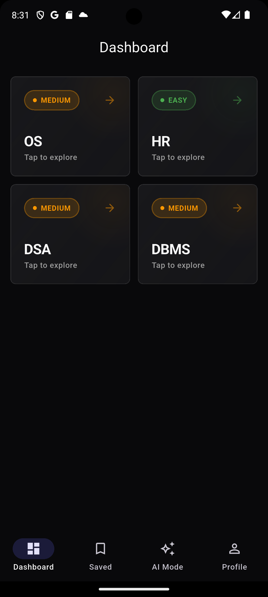
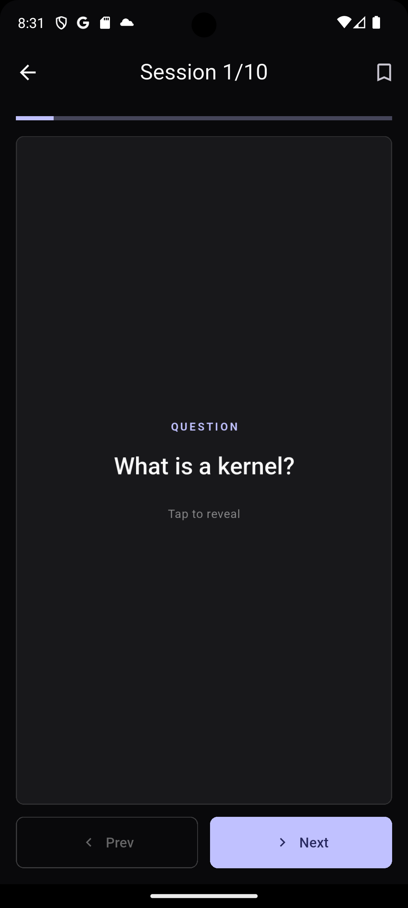
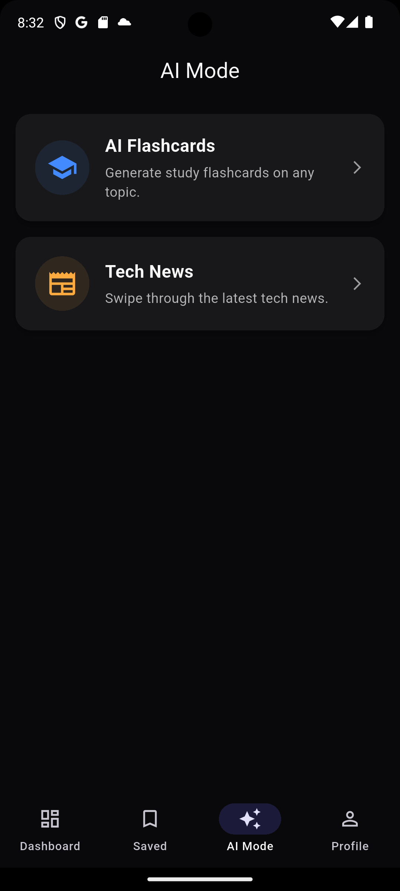
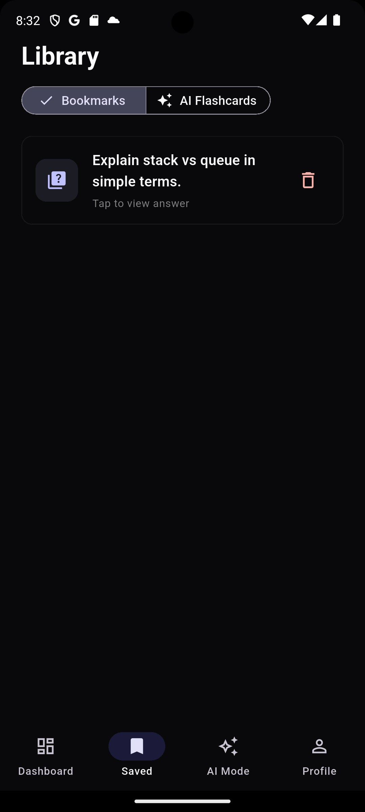

# Elevate Mobile App

**Elevate** is an open-source educational app designed to help students and tech enthusiasts stay informed and learn faster. By combining real-time tech news with powerful AI study aids, Elevate turns your device into a personal learning assistant, a very minimal design is used for the entire app.

## 🎓 Why Use Elevate?

Elevate is built with **students** and **lifelong learners** in mind. Here is how it helps you:

*   **Practice and learn important and in-trend topics**.
*   **Stay Ahead of the Curve 📰**: Don't get left behind. Our **Tech News Aggregator** delivers the latest trends and headlines straight to you, so you're always informed about the industry.
*   **Study Smarter, Not Harder 🧠**: Struggling with a new concept? Use our **AI Flashcards** (powered by Google Gemini) to instantly generate study materials on *any* topic. It’s perfect for cramming before exams or mastering new frameworks.
*   **Digest Information Instantly 📄**: Have a 50-page research paper or documentation? Upload it to our **PDF Summarizer** and get the key takeaways in seconds.

## 📸 App Screenshots

| 1 | 2 | 3  | 4 | 5 |
|------|-----------|---------------|-------------|-----------|
|  |  |  |  |  |


## 🎓 Why Use Elevate?

Elevate is built with **students** and **lifelong learners** in mind. Here is how it helps you:

*   **Practice and learn important and in-trend topics**.
*   **Stay Ahead of the Curve 📰**: Don't get left behind. Our **Tech News Aggregator** delivers the latest trends and headlines straight to you, so you're always informed about the industry.
*   **Study Smarter, Not Harder 🧠**: Struggling with a new concept? Use our **AI Flashcards** (powered by Google Gemini) to instantly generate study materials on *any* topic. It’s perfect for cramming before exams or mastering new frameworks.
*   **Digest Information Instantly 📄**: Have a 50-page research paper or documentation? Upload it to our **PDF Summarizer** and get the key takeaways in seconds.

## ✨ Key Features

*   **Important Subjects**: In demand Topics to learn and Get last minute grasp.
*   **AI-Powered Learning**: Generate flashcards on demand using Generative AI.
*   **Smart News Feed**: Curated technology news to keep you updated.
*   **Document Analysis**: Upload PDFs and get accurate, concise summaries [in near future].
*   **Cloud Sync**: Sign in with Google to save your bookmarks, flashcards, and summaries across devices (powered by Supabase).
*   **Dark Mode**: A sleek, studious interface that's easy on the eyes during late-night study sessions.

## 🛠️ Built With

*   **Flutter** - For a beautiful, cross-platform UI.
*   **Supabase** - For secure authentication and real-time database.
*   **Google Generative AI** - The intelligence behind our flashcards and summaries.
*   **Hive** - For local Storage


---

## 🚀 Getting Started

Want to run this locally for study or development?

### Prerequisites

*   [Flutter SDK](https://docs.flutter.dev/get-started/install)
*   A [Supabase](https://supabase.com/) project
*   A [Google Gemini API Key](https://ai.google.dev/)

### Installation

1.  **Clone the repo**:
    ```bash
    git clone https://github.com/yourusername/elevate.git
    cd elevate
    ```

2.  **Get packages**:
    ```bash
    flutter pub get
    ```

3.  **Setup Environment**:
    Create a `.env` file in the root folder with your keys:
    ```env
    SUPABASE_URL=your_supabase_url
    SUPABASE_ANON_KEY=your_supabase_anon_key
    ```

4.  **Run**:
    ```bash
    flutter run
    ```

---

## 🤝 Contributing

We love contributions! Whether you're a student looking for your first open-source project or an experienced developer, you are welcome here.

### How to Contribute

1.  **Fork** the repository on GitHub.
2.  **Clone** your fork to your local machine.
3.  **Create a Branch** for your feature or bug fix:
    ```bash
    git checkout -b feature/cool-new-feature
    ```
4.  **Make your changes** and test them.
5.  **Commit** with a clear message:
    ```bash
    git commit -m "Added a cool new feature for students"
    ```
6.  **Push** to your fork:
    ```bash
    git push origin feature/cool-new-feature
    ```
7.  **Open a Pull Request** (PR) on the main repository.

### Ideas for Contributions
*   Improve the UI/UX for better accessibility.
*   Add more AI features (e.g., quiz generation).
*   Optimize performance or fix bugs.
*   Improve documentation.

## 📄 License

This project is open-sourced under the MIT License.


